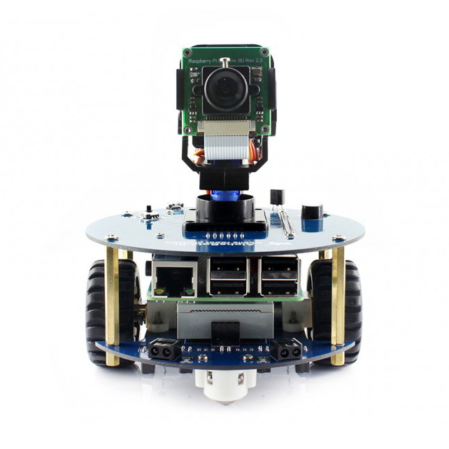

# OrderPickingSystem
Master's thesis - Autonomous order picking system based on the AlphaBot2 robot

# Manual mapping of domain names to IP addresses
Open `C:\Windows\System32\drivers\etc\hosts`  
Add to file `127.0.0.1   mqtt-broker`

## Docker
### Building image
You have to build image from main directory (it would work the same with github actions)
`docker build . -f sources/apps/{Selected Application}/Dockerfile --target release -t {Selected Application}:latest`

Example
`docker build . -f sources/apps/Api/Dockerfile --target release -t api:latest`  
`docker build . -f sources/apps/Web/Dockerfile --target release --build-arg VITE_API_URL="http://172.30.0.199:8080/" -t web:latest`

### Running containers
`cd sources/compose`  
`docker compose --profile {Selected profile} up --abort-on-container-exit; docker compose --profile {Selected profile} down`

Example
`cd sources/compose`  
`docker compose --profile full up --abort-on-container-exit; docker compose --profile full down`

### Check Api
Run
`curl -v http://localhost:8080`

## Backend
`.NET 10`  
Creation of backend `api` project:  
`dotnet new webapi -n Api -o Api/src`  
`cd Api`  
`dotnet new sln -n Api`  
`dotnet sln Api.slnx add src/Api.csproj`  
`cd ../..`  
`dotnet new sln -n OrderPickingSystem`  
`dotnet sln OrderPickingSystem.slnx add apps/Api/src/Api.csproj`

## Frontend
`nodeJs v24.13.1`  
Creation of frontend `web` project:  
`npm create vite@latest`  
Project name: Web  
Package name: web  
Select a framework: React  
Select a variant: TypeScript + React Compiler  
Use Vite 8 beta (Experimental)?: No  
Install with npm and start now: Yes

### first run
`npm install`  
`npm run dev`

## AlphaBot app
Python version: 3.11.4

Local (Windows psh)  
`python -m venv venv`  
`Set-ExecutionPolicy RemoteSigned -Scope CurrentUser`  
`.\.venv\Scripts\Activate.ps1`  
`pip install -r requirements.txt`  
`python main.py`

RaspberryPi  
`python -m venv venv`  
`source venv/bin/activate`  
`pip install -r requirements.txt`  
`python main.py`