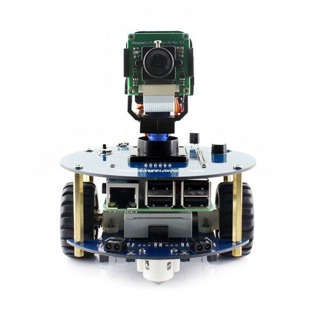

# OrderPickingSystem
Master's thesis - Autonomous order picking system based on the AlphaBot2 robot



# Docker
There are two ways to run the project in Docker - using scripts or manually

## Scripts
Use scripts from:
```
cd sources/scripts/local
```
or
```
cd sources/scripts/production
```

In Linux you need to add execute permission for each script:
```
chmod +x script_name.sh
```

Script descriptions:  
`./run-and-build-containers.sh` - script builds and then runs all containers  
`./run-containers.sh` - script runs all containers only  
`./stop-containers.sh` - script stops and removes all containers  

Remember that you have to run AlphaBot app from `Local run` step below.
In case of any issue, try manually steps.

## Manually

### Building image
You have to build image from main directory.
```
docker build . -f sources/apps/{Selected Application}/Dockerfile --target release -t {Selected Application}:latest
```

#### Backend
Default python dll path for x86_64 architecture (64 bit) is `/usr/lib/x86_64-linux-gnu/libpython3.12.so`.  
If you need to run project in another system you have to check this path.  
Check python dll path: 
```
docker run -it --rm mcr.microsoft.com/dotnet/aspnet:10.0 bash
apt update
apt install -y python3 python3-dev
find /usr -name "libpython3*.so"
```

Examples:  
WSL2 Debian / serwer
```
docker build . -f sources/apps/Api/Dockerfile --target release --build-arg PYTHONNET_PYDLL=/usr/lib/x86_64-linux-gnu/libpython3.12.so -t api:latest
```

Raspberry Pi OS
```
docker build . -f sources/apps/Api/Dockerfile --target release --build-arg PYTHONNET_PYDLL=/usr/lib/arm-linux-gnueabihf/libpython3.12.so -t api:latest
```

#### Frontend
Set correct API_URL.  
If you want to run the project locally you can use localhost url.  
If you want to deploy project on the server then set server url. 

Examples:  
Local WSL
```
docker build . -f sources/apps/Web/Dockerfile --target release --build-arg VITE_API_URL="http://localhost:8080/" -t web:latest
```

Server
```
docker build . -f sources/apps/Web/Dockerfile --target release --build-arg VITE_API_URL="http://172.30.0.199:8080/" -t web:latest
```

### Running containers
```
cd sources/compose  
docker compose --profile {Selected profile} up; docker compose --profile {Selected profile} down
```

Example for all services
```
cd sources/compose  
docker compose --profile full up; docker compose --profile full down
```

Example for separately run:
```
cd sources/compose 
docker compose --profile api up; docker compose --profile api down
docker compose --profile web up --abort-on-container-exit; docker compose --profile web down
```

Remember that you have to run AlphaBot app from `Local run` step below.

# Local run

## Manual mapping of domain names to IP addresses
Open on Windows `C:\Windows\System32\drivers\etc\hosts`  
Or on Linux `/etc/hosts`  
Add to file `127.0.0.1   mqtt-broker`  
Add to file `127.0.0.1   postgres`

### Database and mqtt broker
Remember that you need to use database and mqtt-broker to run backend service.  
The easiest way to do it locally is to use docker (on Windows install docker on WSL)  
Then run script:
```
cd sources/scripts/local/single_runs
./run-stop-service-containers.sh
```

Or do it manually and run:
```
cd sources/compose
docker compose up --abort-on-container-exit; docker compose down
```

## Backend
Install .NET  
SDK: `.NET 10`  
You can follow official Microsoft documentation: `https://learn.microsoft.com/en-us/dotnet/core/install/`  

### Local prerequisites
.NET application uses `Python.NET` package. It means that you have to have installed `python` (Python 3.11).  
Before your first run ensure you have installed `python`. Then execute commands below:  
```
cd sources/apps/Api
python -m venv .venv
.venv\Scripts\activate
pip install -r requirements.txt
```

#### PYTHONNET_PYDLL
Then edit `PYTHONNET_PYDLL` value in `launchSettings.json` file.  
You can execute in CLI:  
`python -c "import sys; print(sys.base_prefix)"`
Then note this value and add at the end of it correct python library with `.dll` extension.

<!-- #### PYTHONHOME
Then you have to edit `PYTHONHOME` value in the same file.  
You have to set path generated by `python -c "import sys; print(sys.base_prefix)"` command. -->

#### PYTHONPATH
Then you have to edit `PYTHONPATH` value in the same file.  
You have to set path to local modules/scripts and to packages installed in .venv environment. For example:
```
C:\\{set_project_directory}\\OrderPickingSystem\\sources\\apps\\Api\\src;C:\\{set_project_directory}\\OrderPickingSystem\\sources\\apps\\Api\\.venv\\Lib\\site-packages
```

#### Update database
Before you will run backend service you have to update database.  
You have to install EF Core command-line tools:
```
dotnet tool install --global dotnet-ef
```

Then you can update database.
```
cd sources/apps/Api/src
dotnet ef database update
```

If you would like to add new migration, you have to run:
```
cd sources/apps/Api/src
dotnet ef migrations add <migrationName> --output-dir Database/Migrations
```

Now you can run backend application locally using VS Code IDE from `Run and Debug` tab.

## Frontend
Install node  
Node version: `nodeJs v24.13.1`  

### first run
`npm install`  
`npm run dev`

## AlphaBot app
Python version: 3.11.4

Local (Windows psh)  
```
python -m venv .venv
Set-ExecutionPolicy RemoteSigned -Scope CurrentUser
.\.venv\Scripts\Activate.ps1
pip install -r requirements.txt
```

RaspberryPi  
```
python -m venv .venv
source .venv/bin/activate
pip install -r requirements.txt
```

If you want to run it locally:  
`python main.py --simulate true --mqttBrokerUrl localhost`

If you want to run it on external device (raspberry pi):  
`python main.py --simulate false --mqttBrokerUrl 172.30.0.199`  
`python main.py --simulate false --mqttBrokerUrl 192.168.0.150`  

If you want to run simulation in production
`python main.py --simulate true --mqttBrokerUrl 172.30.0.199`  
or run script
```
cd sources/scripts/production
./run-robot-simulation.sh
```

In case of host key issues (after SD card change) remember to clean old ones:  
`ssh-keygen -R 192.168.0.151`

# Letting you know
## Backend 'api' project creation procedure:
```
dotnet new webapi -n Api -o Api/src
cd Api
dotnet new sln -n Api
dotnet sln Api.slnx add src/Api.csproj
cd ../..
dotnet new sln -n OrderPickingSystem
dotnet sln OrderPickingSystem.slnx add apps/Api/src/Api.csproj
```

## Frontend 'web' project creation procedure:
`npm create vite@latest`  
Project name: Web  
Package name: web  
Select a framework: React  
Select a variant: TypeScript + React Compiler  
Use Vite 8 beta (Experimental)?: No  
Install with npm and start now: Yes

## How to check api
Run
`curl -v http://localhost:8080`